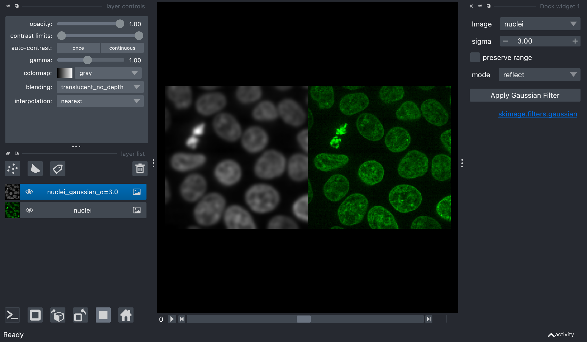
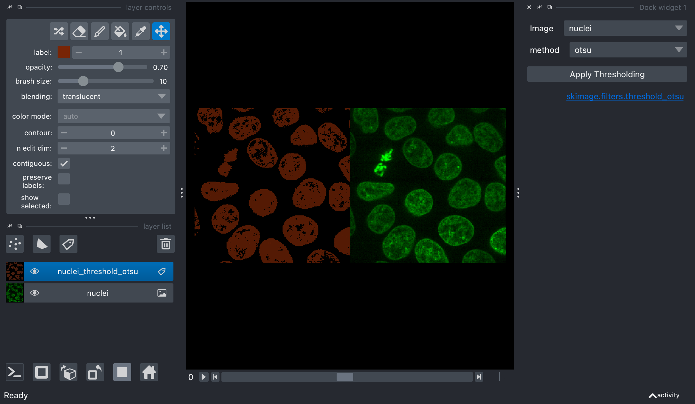
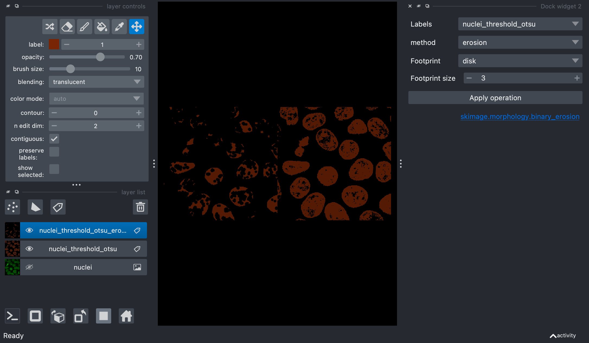
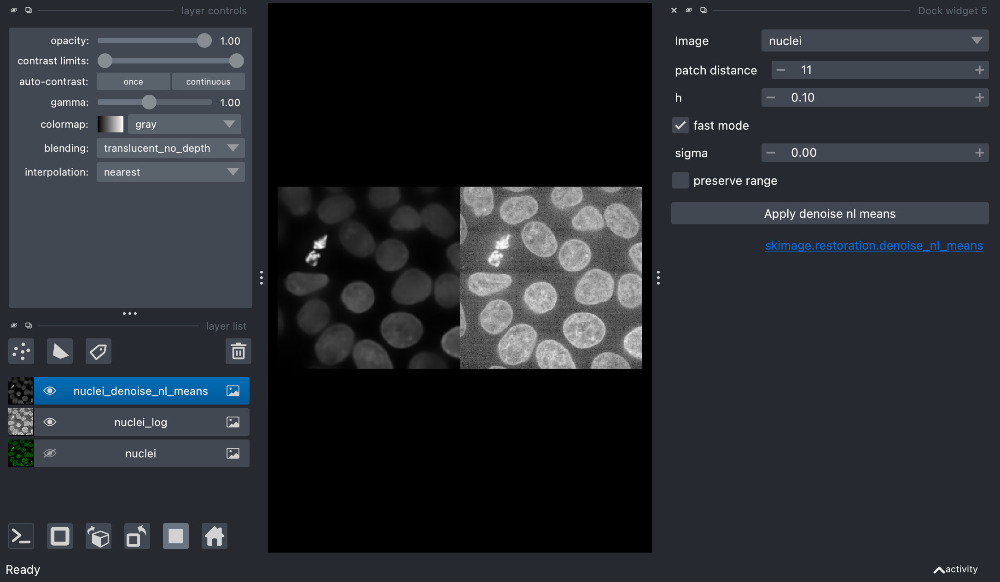
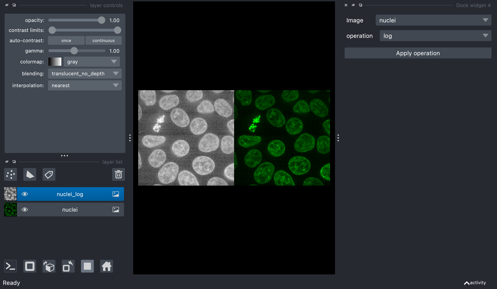

# napari-skimage

[](https://github.com/guiwitz/napari-skimage/raw/main/LICENSE)
[](https://pypi.org/project/napari-skimage)
[](https://python.org)
[](https://github.com/guiwitz/napari-skimage/actions)
[](https://codecov.io/gh/guiwitz/napari-skimage)
[](https://napari-hub.org/plugins/napari-skimage)
[](https://renkulab.io/projects/guillaume.witz1/napari-skimage/sessions/new?autostart=1)

napari-skimage gives easy access to scikit-image functions in napari. The main goal of the plugin is to allow new users of napari, especially without coding experience, to easily explore basic image processing, in a similar way to what is possible in Fiji.

This [napari] plugin was generated with [Cookiecutter] using [@napari]'s [cookiecutter-napari-plugin] template.

## Philosophy

The plugin is still in early development and does not cover all functions of scikit-image. If you are interested in a specific function, please open an issue or a pull request. scikit-image functions are turned into interactive widgets mostly via magicgui, a tool that allows to create GUIs from functions in a simple way (in particular not requiring Qt knowledge). The code avoids on purpose complex approaches, e.g. to automate the creation of widgets, in order to keep the code simple and easy to understand for beginners.

## Installation

You can install `napari-skimage` via [pip]:

    pip install napari-skimage


To install latest development version :

    pip install git+https://github.com/guiwitz/napari-skimage.git

## Usage

The plugin function can be accessed under ```Plugins -> napari-skimage```. Each function will appear as a widget on the right of the napari window. Some functions such as ```Gaussian Filter``` give access to a single operation and its options. Some functions such as ```Thresholding``` give access to variants of the same operation via a dropdown menu. Currently the plugin does not support multi-channel processing and will consider those as stacks. At the moment, the plugin offers access to the following operation types.

### Filtering

A set of classical filters: Gaussian, Prewitt, Laplace etc. as well as rank filters such as median, minimum, maximum etc.



### Thresholding
A set of thresholding methods: Otsu, Li, Yen etc.


### Binary morphological operations
A set of binary morphology operations: binary erosion, binary dilation etc.


### Morphological operations
A set of morphological operations: erosion, dilation, opening, closing etc.


### Restoration
A set of restoration operations such as rolling ball, or non-local means denoising.


### Mathematics 
In addition the plugin provides a set of simple mathematical operators to:
- operate on single images e.g. square, square root, log etc.
- operate on two images e.g. add, subtract, multiply etc.


## Code structure

Each set of functions is grouped in a separate module. For example all filtering operations are grouped in ```src/napari_skimge/skimage_filter_widget.py```. A set of test in ```src/_tests/test_basic_widgets.py``` simply check that each widget can be created and generated an output of the correct size using the default settings.

## Contributing

Contributions are very welcome. Tests can be run with [tox], please ensure
the coverage at least stays the same before you submit a pull request.

## License

Distributed under the terms of the [BSD-3] license,
"napari-skimage" is free and open source software

## Issues

If you encounter any problems, please [file an issue] along with a detailed description.

[napari]: https://github.com/napari/napari
[Cookiecutter]: https://github.com/audreyr/cookiecutter
[@napari]: https://github.com/napari
[MIT]: http://opensource.org/licenses/MIT
[BSD-3]: http://opensource.org/licenses/BSD-3-Clause
[GNU GPL v3.0]: http://www.gnu.org/licenses/gpl-3.0.txt
[GNU LGPL v3.0]: http://www.gnu.org/licenses/lgpl-3.0.txt
[Apache Software License 2.0]: http://www.apache.org/licenses/LICENSE-2.0
[Mozilla Public License 2.0]: https://www.mozilla.org/media/MPL/2.0/index.txt
[cookiecutter-napari-plugin]: https://github.com/napari/cookiecutter-napari-plugin

[file an issue]: https://github.com/guiwitz/napari-skimage/issues

[napari]: https://github.com/napari/napari
[tox]: https://tox.readthedocs.io/en/latest/
[pip]: https://pypi.org/project/pip/
[PyPI]: https://pypi.org/
